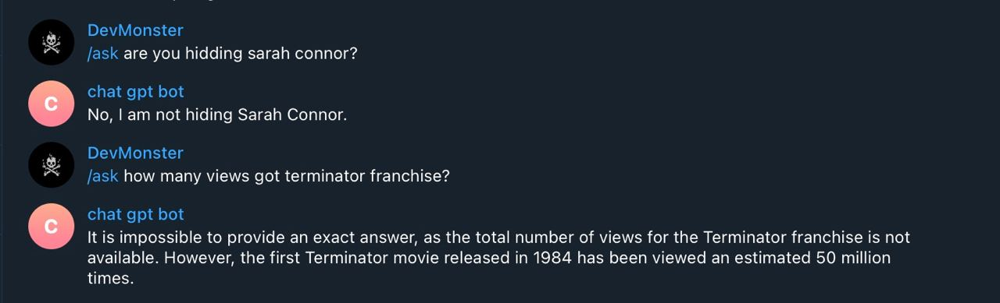

# OpenAI telegram bot

### Pre requisites

- ruby 3.0.3
- bundler
- chat gpt

### Configure project

- put your environment variables on `config/docker.env`

- build the image and install dependencies with
```
docker-compose build
```

or

```
bundle install
```

### Running the project

- Generate chat gpt token [here](https://platform.openai.com/account/api-keys)
- Generate a bot token just need to search by `@BotFather` on telegram and use the `/newbot` command
- Create a account on [ngrok](https://ngrok.com/), download, install and authenticate your account on ngrok
- Run `ngrok http 9292` to watch port 9292 and get the https url that generated for you
- place all variables you got on `.env` and `config/docker.env`
- run the commands bellow to run the project

```
docker-compose up --build
```

or

```
APP_ENV=development bundle exec rackup config.ru -o 0.0.0.0
```

### Example of this working


